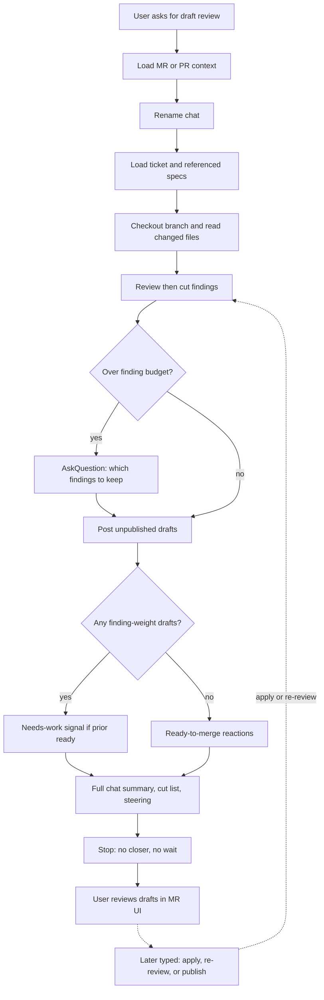

# mad-draft-code-review

Leave unpublished draft review comments on a GitLab MR or GitHub PR, then stop
so the user can edit them in the UI.

Agent instructions live in [`SKILL.md`](SKILL.md). This README documents the
review flow for humans (and for packaging/upload context). Keep workflows
**generic** — no org/project hard-coding (see Mad Skills `AGENTS.md`).

## Name and trigger

| Field | Value |
|-------|--------|
| **name** | `mad-draft-code-review` |
| **description** | Leave unpublished draft code-review comments on GitLab MRs or GitHub PRs. Use when the user asks to review a merge request or pull request, open a draft review, add review comments without publishing, refine pending draft notes, or apply edits / decisions left under existing drafts. |
| **Invocation** | Attach the skill or ask to draft-review an MR/PR |

## Review realization

The only `AskQuestion` in this path is the pre-post budget gate. After drafts
exist, the agent finishes the written reply and stops; the user reviews in the
MR/PR UI.

Removed from this path: the post-pass four-option `AskQuestion` (`Apply my draft
edits now`, `Re-review`, `Publish`, `Nothing for now`). That node used to sit
between the full reply and stop and cut the chat summary short.

Later typed commands still work (`apply draft feedback`, re-review, publish).
The agent never publishes unless the user later asks.

## Out of scope

- Auto-publish, approve, request changes, or merge
- Process maps in `SKILL.md` (agent instructions only; this README is the human doc)
