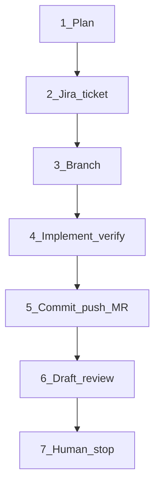

# mad-plan-and-ship-ticket

Thin orchestrator Mad Skill: plan → Jira → branch → implement → commit/push/MR → unpublished draft review → **stop for human merge**.

Agent instructions live in [`SKILL.md`](SKILL.md). This README documents the pipeline for humans (and for packaging/upload context). Keep workflows **generic** — no org/project hard-coding (see Mad Skills `AGENTS.md`).

## Name and trigger

| Field | Value |
|-------|--------|
| **name** | `mad-plan-and-ship-ticket` |
| **description** | Orchestrates ticket delivery from plan through unpublished draft MR review and stops for human merge. Use when the user asks to ship work end-to-end, `/mad-plan-and-ship-ticket`, or plan → Jira → branch → implement → commit/MR → draft review. |
| **Invocation** | Explicit attach / slash only (`disable-model-invocation: true`) |

## Pipeline (hard-gated)

1. **Plan** — Plan mode when non-trivial; wait for explicit approve/execute.
2. **Jira** — Hand off entirely to `mad-jira-tickets` (parent, assignee=me, labels, active sprint, In Progress, ADF from plan). This skill only supplies inputs and checks the In Progress gate fired.
3. **Branch** — Glue: fetch base, Create-branch-style name, checkout, `SetActiveBranch`. Never merge.
4. **Implement + verify** — Execute plan; run plan verify before shipping.
5. **Commit + push + MR** — Hand off commit to `mad-git-commit`; glue: push (unless user forbids), open MR with `Closes KEY`, never merge. Links via `mad-visible-links`.
6. **Draft review** — Hand off entirely to `mad-draft-code-review`.
7. **Stop** — Human review/merge; no auto-merge / no publish drafts.

## Glue gates (orchestrator checks only)

Anything already owned by a delegated skill (ADF, commit format, review voice) is **not** restated in `SKILL.md`. This skill only enforces:

| Gap | Why (glue) |
|-----|------------|
| Explicit **In Progress** after create | Easy to skip after sprint/labels; still a ship-ticket gate |
| **Fetch/update base** before branch | Avoid stale default branch |
| **Cursor branch metadata** (`SetActiveBranch`) | Keep agent UI/cwd on the feature branch |
| **Verify before ship** | Run plan verify before commit/MR |
| **Same ticket/MR for in-place follow-ups** | Do not open a second ticket by default |
| **Re-review after push to open MR** | Invoke `mad-draft-code-review` again |
| **GitLab `glab` vs GitHub `gh`** | Detect from `git remote` |
| **Push default; honor “don’t push”** | This skill pushes unless user overrides |
| **Do not invent ticket if one already owns the work** | Ask once if ambiguous |

Ask **one** question if parent, labels, or sprint cannot be inferred.

## Composition (non-negotiable)

`mad-plan-and-ship-ticket` is a **thin orchestrator only**. Reuse Mad Skills; do not re-implement them.

| Step | Delegate to |
|------|-------------|
| Ticket create/update, ADF, labels, sprint, Blocks/Rank, In Progress | **Read and follow** [`mad-jira-tickets`](../mad-jira-tickets/SKILL.md) |
| Conventional commits / atomic commits / no attribution | **Read and follow** [`mad-git-commit`](../mad-git-commit/SKILL.md) |
| Unpublished draft review, chat rename, :white_check_mark:/:speech_balloon:, chat summary | **Read and follow** [`mad-draft-code-review`](../mad-draft-code-review/SKILL.md) |
| Human-visible titles + full URLs in ticket/MR text | **Read and follow** [`mad-visible-links`](../mad-visible-links/SKILL.md) when linking |
| MCP auth probes if Atlassian/GitLab/GitHub fail | **Read and follow** [`mad-check-connections`](../mad-check-connections/SKILL.md) only when needed |
| On-request ticket progress / handoff comment (and confirmed AC checkboxes) | **Read and follow** [`mad-ticket-progress`](../mad-ticket-progress/SKILL.md) only when the user asks |

Rules for the agent (`SKILL.md`):

- Open each skill’s `SKILL.md` and obey it for that step (same as the user attaching the skill).
- Keep only **glue**: order of steps and gates listed above.
- **Forbidden:** copy-pasting commit regexes, ADF tables, draft-note API details, or review voice rules into this skill.
- If a glue rule conflicts with a delegated skill, **delegated skill wins** (except hard gates: never merge; stop for human).

## Out of scope

- Auto-merge, auto-publish review, auto-transition ticket to Done
- Fixed project keys / company label catalogs
- Duplicating any delegated Mad Skill’s procedures
